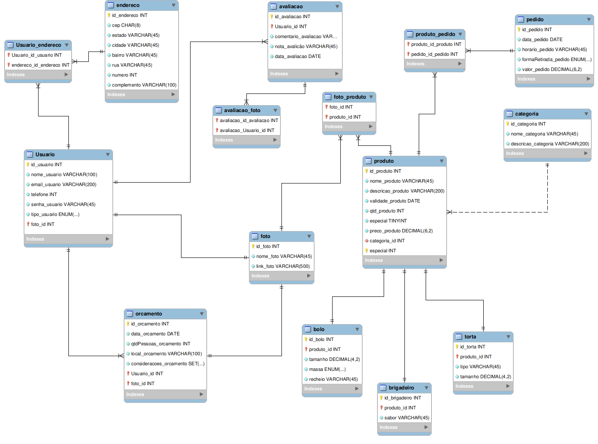
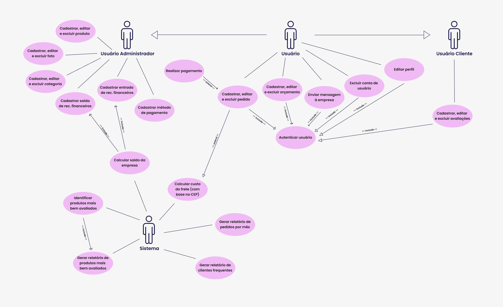

# Projeto Santa Dallah :cake:

Esse projeto tem o propósito de desenvolver um sistema para uma empresa de confeitaria de Joinville chamada Santa Dallah. O projeto tem como objetivo exibir o catálogo de produtos da empresa, vender os produtos e oferecer para o usuário uma interface onde ele pode personalizar seu pedido.

Professor: [Marco André Mendes](github.com/marcoandre)

Equipe:
- [Ana Laura Manfron Dias](https://github.com/analauradias)
- [Isabelli Luisa Rosa](https://github.com/isabellirosa)
- [Júlia Fuck](https://github.com/fujulia)
- [Rafaela Barbieri da Cruz](https://github.com/rafaelabarbieric)
  
  
Links do projeto:

-   [Documentação (esse documento)](https://github.com/fujulia/Projeto-Integrador)
-   Backend: [Repositório](https://github.com/Projeto-Santa-Dallah/SantaDallah_BackEnd) e [Publicação](https://santadallah-backend.onrender.com/api)
-   Frontend: [Repositório](https://github.com/Projeto-Santa-Dallah/SantaDallah_FrontEnd) e [Publicação](https://santa-dallah-front-end-wyv3.vercel.app/)
  
  

# 1. Desenvolvimento

## Sistema de Vendas

O sistema planeja ter uma interface tanto para o usuário cliente quanto para o usuário administrador. Para o usuário cliente o sistema se apresenta como um site de vendas de bolos, tortas e brigadeiros, no qual o usuário pode selecionar, comprar, avaliar e personalizar seu próprio produto. O usuário cliente pode também  montar o seu pedido a partir das opções de sabores que a empresa oferece, por exemplo ele poderá montar um bolo escolhendo o sabor da massa e do recheio, além de escolher o peso, formato e decoração. Para o usuário administrador o sistema funcionará como uma interface de controle de produtos, clientes, pedidos e respostas de usuários. 
	
O motivo da escolha por esse tipo de sistema se deve ao fato do grupo possuir contato com uma empresa de confeitaria que tem interesse em modernizar sua gestão de vendas de pedidos.  

# 2. Situação Problema

	
A empresa escolhida para o desenvolvimento do sistema não se trata de um negócio fictício, mas sim de um estabelecimento real localizado em Joinville. A empresa, chamada Santa Dallah, é uma confeitaria que produz bolos, tortas e brigadeiros e está no mercado desde 2019, tendo assim 6 anos de experiência.  Foi fundada por Anderson e Geisiane, um casal que busca trazer mais doçura e amor para os momentos especiais das pessoas, o Anderson é responsável pela criação e produção dos doces e a Geisiane pelo atendimento e todo o administrativo da empresa. Desse modo, eles são os únicos funcionários da empresa  e precisam de uma ferramenta tecnológica que os auxiliem a gerenciar seu processo de venda. 

Na maioria dos casos, o primeiro contato do cliente com a Santa Dallah ocorre por meio do Instagram. Em seguida, ele é direcionado para o WhatsApp, onde poderá concluir seu pedido. Nessa etapa, é essencial confirmar se o pedido está sendo realizado com, no mínimo, dois dias de antecedência ao evento. Após essa verificação, o cliente fornece suas informações pessoais, especifica o tipo de doce desejado e, se necessário, encaminha uma imagem ilustrativa como referência para a personalização do produto. Além disso, são definidos a forma de pagamento e os detalhes sobre a entrega.
 	
O processo de produção do doce ocorre conforme o tipo solicitado. Por exemplo, a montagem de bolos decorados é realizada em etapas: inicialmente, são preparados a massa e os recheios, geralmente com um dia de antecedência. No dia da entrega, é feita a montagem e decoração do bolo. Os mesmos métodos são aplicados aos brigadeiros, que são preparados no dia anterior e finalizados no dia da entrega. Já as tortas e os bolos vulcão são inteiramente produzidos no próprio dia da entrega.

No dia do evento, a entrega do doce pode ser realizada por um funcionários ou, caso prefira, o cliente pode retirá-lo diretamente no ateliê. Durante esse processo, também é efetuado o pagamento do produto.

Ao longo do processo de venda, identificamos diversos desafios que impactam tanto o trabalho dos funcionários quanto a experiência dos clientes. Com o objetivo de facilitar essa jornada, decidimos criar uma solução que integrasse todas as ferramentas utilizadas pela empresa em um único site. O Instagram, por exemplo, é uma plataforma essencial para apresentar o trabalho da empresa e gerar o interesse de compra. No entanto, no nosso sistema, substituiremos a necessidade do Instagram por diversas imagens que incentivem o usuário a realizar a compra, sempre destacando a qualidade dos produtos do estabelecimento.	

A página inicial do site será cuidadosamente desenvolvida para exibir informações detalhadas e fotos que mostrem a excelência dos produtos vendidos. Além disso, teremos uma seção dedicada a imagens de doces de casamento, oferecendo aos clientes a oportunidade de conhecer o trabalho do ateliê da empresa e se inspirar para o design do seu bolo.

Após o cliente conhecer a empresa por meio do Instagram, ele é direcionado para o WhatsApp da empresa, onde realiza seu pedido. Ao iniciar o contato, o funcionário responsável pelo atendimento envia um PDF com informações sobre a empresa, além de fotos, características e preços dos produtos. Para tornar essa etapa mais rápida e moderna (já que nem sempre o contato no WhatsApp ocorre de forma automática) , nosso site integrará todo o processo de compra.Haverá uma página de produtos com todas as informações do PDF, e os doces com sabores personalizados poderão ser montados conforme a escolha do cliente. Além disso, se o produto for um bolo, o cliente poderá enviar uma imagem de referência para a decoração. O pagamento será feito diretamente no site, e o cliente poderá escolher entre a entrega ou a retirada do produto.

Para facilitar o gerenciamento, será criada uma página de administração, onde os funcionários da Santa Dallah poderão acompanhar e gerenciar todos os pedidos de forma eficiente.

# 3. Descrição da proposta

O software tem como foco **automatizar** o processo de venda dos produtos da empresa Santa Dallah. Ele irá apresentar **dois níveis de usuários, cliente e administrador**, o usuário administrador tem acesso as páginas de administração do sistema e as páginas de venda, sendo assim possui acesso a todo o sistema, e o usuário cliente possui acesso apenas as páginas de venda. **Os usuários administradores são os donos da empresa e os usuários clientes são as pessoas no geral que usarem o sistema**. Nas páginas de administração será possível **adicionar, editar e excluir os produtos vendidos pela empresa, além de gerenciar os clientes e os pedidos**. Já nas páginas de venda será possível **visualizar, comprar e curtir produtos, comentar sobre os produtos, se cadastrar e realizar login, montar seu proprio bolo por meio de um formulário e mandar mensagens para a empresa**. 

# 4. Modelagem de Dados

# 5. Regras de negócio

- **RN001 - Cadastro de Cliente:** Para realizar pedidos, o cliente deve estar cadastrado no site.
- **RN002 - Solicitação de pedido:** Para submeter um pedido é necessário identificar se ele está sendo realizado com, no mínimo, dois dias de antecedência ao evento.
- **RN003 - Pedidos de brigadeiro:** Para pedidos de brigadeiros é necessário que sejam solicitadas, no mínimo, 25 unidades.
- **RN004 – Inserir produtos no carrinho:** Para inserir um produto no carrinho, é necessário que o produto esteja cadastrado no sistema e que a quantidade seja acima de zero.
- **RN005 - Métodos de pagamento:** Para realizar o pagamento, o cliente deve selecionar uma das opções de método de pagamento, sendo elas: “Cartão de crédito” e ”Pix”.
- **RN006 - Cálculo do frete:** Para calcular o valor do frete deve-se levar em consideração a distância (em quilômetros) e o horário em que a entrega deverá ser feita, já que em horas em que o tráfego é mais demorado, a entrega irá levar mais tempo para ser concluída.
- **RN007 - Confirmação do pedido:** Para se confirmar um pedido, é necessário que metade do valor dele seja pago antes de iniciar a preparação.
# 6. Requisitos funcionais

**Entradas:**

- **RF001 - Cadastro de usuário:** tem como propósito criar uma conta para que o usuário possa realizar ações no site. O usuário pode ser cadastrado como cliente ou como administrador. 
  - **Dados necessários:** Email, senha, tipo de usuário, código do usuário.
  - **Usuários:** todos os níveis de usuário.

- **RF002 - Cadastro de categoria:** tem como propósito cadastrar as categorias que serão atribuídas a cada produto da loja.
  - **Dados necessários:** Código da categoria,nome, descrição.
  - **Usuários:** Somente administrador.

- **RF003 - Cadastro de produto:** tem como propósito cadastrar os produtos vendidos pela loja.
  - **Dados necessários:** Código do produto, categoria, nome, descrição, validade, preço, quantidade, se é especial e fotos. Se o produto for um bolo é necessario cadastar o tamanho, a massa e o recheio, se for brigadeiros é necessario o sabor e para torta tamanho e tipo da torta.
  - **Usuários:**  Somente administrador.

- **RF004 - Cadastro de pedido:** tem como propósito cadastrar um pedido feito por um usuário.
  - **Dados necessários:** Código do pedido, produtos, cliente, data, forma de retirada, horário e valor.
  - **Usuários:** Todos os níveis de usuários.

- **RF005 - Cadastro de foto:** tem como propósito cadastrar uma foto referente a um produto vendido pela empresa. 
  - **Dados necessários:** Código da foto, nome, link.
  - **Usuários:**  Somente administrador.

- **RF006 - Cadastro de orçamento:** tem como propósito cadastrar orçamentos realizados por usuários clientes.
  - **Dados necessários:** Código do orçamento, cliente, data, quantidade de pessoas, local, considerações e foto.
  - **Usuários:** Todos os níveis de usuário.

- **RF007 - Cadastro de avaliação:** tem como propósito cadastrar avaliações feitas por usuários clientes.
  - **Dados necessários:** Código da avaliação, cliente, produto, descrição, nota, foto, data.
  - **Usuários:** Cliente.

- **RF008 - Entrada de recursos financeiros:** tem como propósito registrar os valores monetários recebidos pela empresa
  - **Dados necessários:** Valor, data, descrição. 
  - **Usuários:** Somente administrador.

**Processos:**

- **RF009 - Autenticação de usuário:** tem como propósito identificar se os dados inseridos no login estão cadastrados em um usuário no banco de dados e se sim identifica o tipo de usuário e o direciona para a página principal de seu perfil de acesso. 
  - **Dados necessários:**Email, senha, tipo de usuário.
  - **Usuários:** Todos os níveis de usuário.
 
- **RF010 - Edição de usuário:** tem como propósito alterar os dados de um usuário.
  - **Dados necessários:** Dado(s) que o usuário deseja mudar (podendo ser senha, nome, email, endereço ou telefone).
  - **Usuários:** Todos os níveis de usuário.

- **RF011 - Edição de produto:** tem como propósito alterar os dados de um determinado produto.
  - **Dados necessários:** Dado(s) que se deseja mudar no produto ( podendo ser categoria, nome, descrição, validade, quantidade, preço, se é especial ou foto).
  - **Usuários:** Somente administrador.

- **RF012 - Edição de avaliação:** tem como propósito alterar os dados de uma determinada avaliação.
  - **Dados necessários:** Dado(s) que se deseja mudar na avaliação ( podendo ser  descrição, nota ou foto).
  - **Usuários:** Cliente.

- **RF013 - Edição de pedido:** tem como propósito alterar os dados de um determinado pedido.
  - **Dados necessários:** Dado(s) que se deseja mudar no pedido (  produtos, data, horário ou forma de retirada).
  - **Usuários:** Todos os níveis de usuários.

- **RF014 - Edição de categoria:** tem como propósito alterar os dados de uma determinada categoria. 
  - **Dados necessários:** Dado(s) que se deseja mudar na categoria (nome ou descrição).
  - **Usuários:** Somente administrador.

- **RF015 - Edição de orçamento:** tem como propósito alterar os dados de um determinado orçamento.
  - **Dados necessários:** Dado(s) que se deseja mudar no orçamento(data, quantidade de pessoas, local, considerações ou foto).
  - **Usuários:** Todos os níveis de usuários.

- **RF016 - Edição de foto:** tem como propósito alterar os dados de uma determinada foto.
  - **Dados necessários:** Dado(s) que se deseja mudar na foto (nome ou link).
  - **Usuários:** Somente administrador.

- **RF017 - Exclusão de usuário:** tem como propósito excluir um usuário. 
  - **Dados necessários:** id do usuário. 
  - **Usuários:** Somente administrador.

- **RF018 - Exclusão de produto:** tem como propósito excluir um produto.
  - **Dados necessários:** id do produto.
  - **Usuários:** Somente administrador.

- **RF019 - Exclusão de avaliação:** tem como propósito excluir uma avaliação.
  - **Dados necessários:** id da avaliação.
  - **Usuários:**  Todos os níveis de usuários.

- **RF020 - Exclusão de pedido:** tem como propósito excluir um pedido.
  - **Dados necessários:** id do pedido.
  - **Usuários:**  Todos os níveis de usuários.

- **RF021 - Exclusão de categoria:** tem como propósito excluir uma categoria.
  - **Dados necessários:** id da categoria.
  - **Usuários:** Somente administrador.

- **RF022 - Exclusão de orçamento:** tem como propósito excluir um orçamento.
  - **Dados necessários:** id do orçamento.
  - **Usuários:** Somente administrador.

- **RF023 - Exclusão de foto:** tem como propósito excluir uma foto.
  - **Dados necessários:** id da foto.
  - **Usuários:** Somente administrador.

- **RF024 - Cálculo de frete:** tem como propósito calcular o preço da entrega até a casa do cliente. 
  - **Dados necessários:** Cep do usuário.
  - **Usuários:** Todos os níveis de usuários.

- **RF025 - Pagamento:** tem como propósito fazer com que o cliente pague o produto que comprou.
  - **Dados necessários:** Valor, método de pagamento.
  - **Usuários:** Usuários clientes. 

- **RF026 - Enviar mensagem:** tem como propósito fazer com que o usuário cliente consiga mandar emails para a empresa.
  - **Dados necessários:** Remetente, destinatário, assunto e mensagem. 
  - **Usuários:** Todos os níveis de usuários.

- **RF027 - Cálculo de saldo:** tem como propósito calcular a diferença entre o dinheiro que entra e o dinheiro que sai da empresa.  
  - **Dados necessários:** Saída e entrada de recursos financeiros.
  - **Usuários:** Somente administrador.

**Saídas:**

- **RF028 - Relatório de produtos mais bem avaliados:** têm como propósito listar os produtos com as maiores notas de avaliação.  
  - **Dados necessários:** Produtos e avaliações. 
  - **Usuários:** Somente administrador.

- **RF029 - Relatório de pedidos por mês:** tem como propósito listar os pedidos que foram feitos em determinado mês e mostrar o total de pedidos feitos.  
  - **Dados necessários:** Pedidos. 
  - **Usuários:** Somente administrador.

- **RF030 - Relatório de clientes frequentes:** tem como propósito listar os clientes que realizam mais pedidos na empresa.  
  - **Dados necessários:** Usuários do tipo cliente e pedidos. 
  - **Usuários:** Somente administrador.

- **RF031 - Saída de recursos financeiros:** tem como propósito registrar os valores monetários gastos pela empresa.
  - **Dados necessários:** Valor, data, descrição.
  - **Usuários:** Somente administrador.

# 7. Requisitos não funcionais

- **RNF001 - Tecnologia FrontEnd:** O sistema deve ter seu frontend desenvolvido em VueJs.
- **RNF002 - Tecnologia BackEnd:** O sistema deve ter seu backend desenvolvido em Django Rest Framework.
- **RNF003 - Design:** O sistema deve ter suas telas prototipadas no Figma.
- **RNF004 - Ambiente:** O sistema deve ser desenvolvido para ambiente web.
- **RNF005 - Autenticação:** O sistema deve ter sua autenticação feita com o passager.
- **RNF006 - Responsividade:** O sistema deve ser desenvolvido para desktop, tablet e celular.
- **RN007- Ambiente de Desenvolvimento Integrado:** Para criação do sistema, será utilizado o editor de texto Visual Studio Code.

# 8. Diagrama de Caso de Uso

